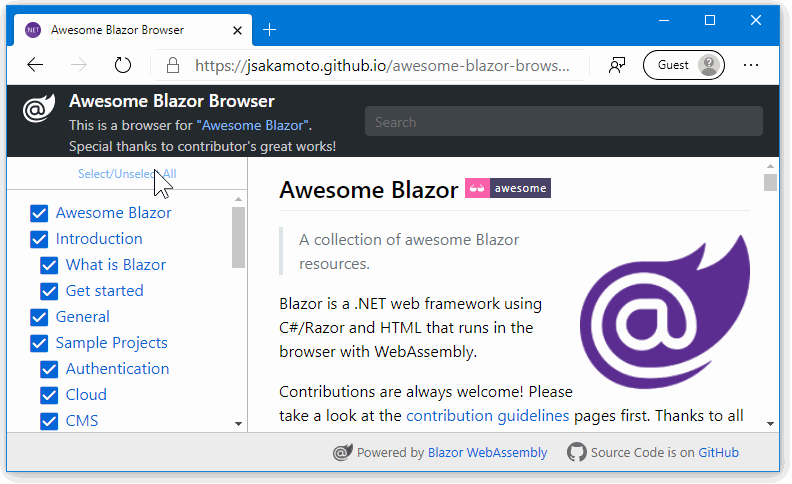

# Awesome Blazor Browser 

This is a Blazor WebAssembly web app for browsing the **"Awesome Blazor"** resources.

This Blazor WebAssembly web app fetches the "README.md" text from the ["Awesome Blazor"](https://github.com/AdrienTorris/awesome-blazor/#awesome-blazor-) GitHub repository on the fly, and parse it.

## Links

- [**"Awesome Blazor Browser"**](https://jsakamoto.github.io/awesome-blazor-browser/)
- Original ["Awesome Blazor" GitHub repository](https://github.com/AdrienTorris/awesome-blazor/#awesome-blazor-)

## License

[GNU General Public License v3.0](LICENSE)

See also: [THIRD-PARTY-NOTICES.txt](THIRD-PARTY-NOTICES.txt)